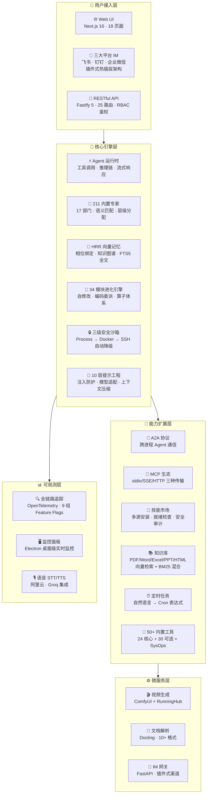

<p align="center">
  
</p>

<p align="center">
  <b>下一代模块化 AI Agent 操作系统</b><br/>
  <sub>🧠 211 内置专家 · 🔮 HRR 向量记忆 · 🕸️ 知识图谱推理 · 🤝 A2A 跨进程通信 · 🧬 34 模块进化引擎 · 💬 三大平台 IM · 🎬 端到端视频生成 · 🖱️ 桌面操控 · 🔒 三级安全沙箱</sub>
</p>

<p align="center">
  <a href="https://github.com/Louis830903/Super-Loong/stargazers"></a>
  <a href="https://github.com/Louis830903/Super-Loong/network/members"></a>
  <a href="https://github.com/Louis830903/Super-Loong/blob/main/LICENSE"></a>
  <a href="https://github.com/Louis830903/Super-Loong"></a>
  <a href="https://github.com/Louis830903/Super-Loong"></a>
</p>

<p align="center">
  
  
  
  
  
  
  
  
  
  
  
</p>

---

<div align="center">

```
╔══════════════════════════════════════════════════════════════════════════════╗
║  🧠 211 内置专家 │ 🔮 HRR 向量记忆 │ 🕸️ 知识图谱推理 │ 💬 三大平台 IM     ║
║  🤝 A2A 协议    │ 🧬 34 模块自进化 │ 🔒 三级沙箱     │ 🎬 端到端视频生成  ║
║  🖱️ 桌面操控    │ 🔧 50+ 内置工具  │ 📝 10 层提示工程 │ 🛒 电商运营自动化  ║
╚══════════════════════════════════════════════════════════════════════════════╝
```

</div>

---

## 📑 目录

- [为什么选择 Super Agent？](#-为什么选择-super-agent)
- [数字员工实战](#-数字员工实战)
- [系统架构全景](#-系统架构全景)
- [核心能力矩阵](#-核心能力矩阵)
- [平台规模一览](#-平台规模一览)
- [211 内置专家全景](#-211-内置专家全景)
- [为什么不是其他平台？](#-为什么不是其他平台)
- [系统操作能力](#️-系统操作能力--你真正的数字员工)
- [快速开始](#-快速开始)
- [生产部署](#-生产部署)
- [架构一览](#️-架构一览)
- [模型 Provider 矩阵](#-模型-provider-矩阵)
- [安全架构](#-安全架构)
- [Feature Flags 灰度体系](#-feature-flags-灰度体系)
- [路线图](#️-路线图)
- [Star 趋势](#-star-趋势)
- [已知限制](#-已知限制)
- [开发指南](#️-开发指南)
- [贡献者](#-贡献者)
- [社区与支持](#-社区与支持)
- [开源协议](#-开源协议)

---

## ✨ 为什么选择 Super Agent？

Super Agent 不是又一个 AI 聊天机器人——它是**全球唯一同时具备「桌面操控 + 211 专家 + 三平台 IM + 源码级自进化」的生产级智能体操作系统**。

> **只此一家，别无分店：**
> - 🖱️ **真正操控电脑**：鼠标键盘、桌面窗口、截屏 OCR——不是"建议"而是"执行"
> - 🧠 **211 个专家不糊弄**：每个是完整 System Prompt + Toolset，不是关键词匹配
> - 🔮 **HRR 代数向量记忆**：能做绑定/解绑/叠加运算，不是 cos-sim 玩具
> - 🧬 **Agent 自己写代码改进自己**：34 模块进化引擎，源码级自修改（targetCode + diff + 沙箱验证）
> - 💬 **一套代码通三平台**：飞书/钉钉/企业微信，插件式热插拔无缝接入
> - 🎬 **一句话出片**：ComfyUI 工作流 + RunningHub，从文案到成片全自动
> - 🛒 **电商运营自动化**：微信小店 + 抖音小店双平台，商品管理/订单发货/日常巡检
> - 🔒 **三级安全沙箱**：Process → Docker → SSH 自动降级，50+ 危险命令实时拦截
> - 📊 **9 组 Feature Flags**：工业级灰度发布体系，每个功能可独立开关/回滚

---

## 🤖 数字员工实战

把 Agent 当成真正的数字员工——**一句话，全自动搞定**：

| 你只需要说... | Agent 自动完成... |
|-------------|------------------|
| 🗂️ "把这个文件夹的 PDF 全转成 Markdown，导入知识库" | PDF 解析 → OCR → 格式化 → 向量化入库 |
| 💬 "打开飞书，给 @张三 发消息说部署完成" | 操控飞书 → 定位聊天窗口 → 发送消息 |
| 🔍 "检查服务器 8080 端口，如果被占用就杀进程并重启" | 网络诊断 → 进程管理 → 部署重启 |
| 🎬 "生成一段 30 秒产品介绍视频，配上背景音乐" | 写文案 → 调 ComfyUI 工作流 → 渲染 → 合成 BGM |
| 🐳 "把这个 Next.js 项目 Docker 化并推到服务器部署" | 写 Dockerfile → 构建镜像 → 推送到服务器 → 拉起容器 |
| 📊 "每天下午 6 点自动抓 GitHub Star 数，发到企微群" | 定时任务 → HTTP 请求 → 企微 Webhook 发送 |
| 🛒 "帮我在微信小店后台批量上架这 20 个新品" | 浏览器自动登录 → 填写商品信息 → 批量上架 → 回报结果 |
| 🧬 "分析最近的代码改动，生成改进提案并 diff 对比" | 代码分析 → LLM 审查 → targetCode 提案 → before/after diff → 提交审核 |
| 🔐 "用 AES-256 加密存储这些 API Key，并配置自动轮转" | CredentialVault 加密 → TokenProxy 代理 → 安全存储 |

**开箱即用，一切皆可 Agent。**

---

## 🏗️ 系统架构全景



---

## 🚀 核心能力矩阵

<table>
<tr>
<td width="50%">

### 🧠 211 内置专家 Agent
17 个部门、211 个领域专家开箱即用——从金融风控到游戏开发，从法律文档到供应链优化。**Hierarchical 智能分配**自动语义匹配最合适的专家处理任务，A2A 协议实现跨专家协作。

**炸裂点**：不是「配置 211 个选项」，而是实打实的 211 套独立 System Prompt + Toolset。**一个任务来了，自动找到最对口的专家接手**——金融问题不会让码农专家回答。

</td>
<td width="50%">

### 🤝 多 Agent 协作 + A2A 协议
**层级/并行/串行**三种协作拓扑 + **Google A2A 协议**跨进程通信。Agent 间自动路由、任务委托、结果汇聚。远程 Agent 透明调用，像本地一样简单。

**炸裂点**：子代理独立上下文窗口 + A2A 跨进程发现，分布式 Agent 网络。

</td>
</tr>
<tr>
<td width="50%">

### 🔮 HRR 向量记忆 + 知识图谱
**HRR 全息相位向量**实现符号级记忆绑定/解绑操作，而非简单的余弦相似度。**知识图谱** RDF 三元组 + 传递闭包推理（`parentOf → ancestorOf`）。**FTS5 全文搜索**中英文混合，BM25 打分 + unicode61 分词。

**炸裂点**：不只是"向量搜索"，是真正的符号推理级记忆——Agent 能「记住」「理解」「推理」。

</td>
<td width="50%">

### 📝 10 层提示工程
L1-L6 静态缓存层（系统身份/安全策略/记忆/技能）+ L7-L10 动态注入层（上下文压缩/平台适配/跨语言翻译）。**注入防护**自动清洗恶意 prompt，**模型适配器**为每个模型调整格式。

**炸裂点**：工业级提示词工程，而非一个 `system: "你是..."` 完事。

</td>
</tr>
<tr>
<td width="50%">

### 🧬 双引擎自我进化（Phase 2 全面落地）
**Nudge 反思引擎**：每次对话后自动反思，提取洞察，优化策略。**进化引擎 Phase 2**：34 个进化模块全面落地——自适应执行器动态调整策略、自动学习器从交互中提取可复用模式、**源码级自修改引擎**（LLM 分析代码缺陷 → 产出 targetCode 提案 → before/after diff 对比 → 沙箱验证后应用）、编码委派器智能分配编码任务给子代理。20+ 算子体系（base/recombination/refinement/revision）驱动技能自动进化，质量关卡 + 审计 + 预算控制确保安全放权。

**炸裂点**：不仅是「生成技能文件」——Agent 能**自己写代码改进自己**，有 diff 对比、沙箱验证、人工审批三道关卡。

</td>
<td width="50%">

### 🔒 三级安全沙箱 + 凭据保险柜
**Process → Docker → SSH** 三级自动降级。`CredentialVault` AES-256 加密密钥库，`TokenProxy` 代理敏感凭证。**危险命令实时拦截**：`rm -rf`、`sudo`、`curl|bash` 等 50+ 模式。**9 组 Feature Flags** 支持灰度回滚。

**炸裂点**：代码执行全覆盖，危险操作 0 容忍，凭据 0 明文。

</td>
</tr>
<tr>
<td width="50%">

### 💬 三大平台 IM 网关
| 国内平台 | 说明 |
|----------|------|
| 🐦 飞书 | 已对接，消息/卡片/文件全支持 |
| 📌 钉钉 | OAuth 2.0 新 API 升级完成 |
| 💼 企业微信 | 已对接，消息收发畅通 |

**插件式热插拔架构**——一套代码三平台复用，消息格式自动适配，渠道零耦合。

</td>
<td width="50%">

### 🎬 端到端视频生成 + 🧩 MCP 生态
**ComfyUI 工作流** + **RunningHub 云端模型**，从文案到成片全链路自动化。视频 Crew 专用编排，多 Agent 协同出片。

**MCP 生态**：**stdio/SSE/HTTP** 三种传输，Bearer/API-Key/Basic 认证。技能市场**多源安装**（GitHub/SkillHub/ClawHub/Local），**安全审计引擎**扫描恶意代码。

</td>
</tr>
</table>

---

## 📊 平台规模一览

| 维度 | 数字 | 说明 |
|------|:--:|------|
| 🧠 内置专家 Agent | **211** | 17 个部门，从金融到供应链，165 翻译 + 46 原创 |
| 🔌 API 路由 | **25** | Fastify 5 全 RESTful，RBAC 四级鉴权 |
| 🌐 Web 页面 | **18** | Next.js 16 全功能面板，React 19 |
| 💬 IM 渠道 | **3** | 飞书/钉钉/企业微信，插件式热插拔 |
| 🔧 内置工具 | **50+** | 24 核心同步 + 30 可选延迟加载 + SysOps 系列 |
| 🧬 进化模块 | **34** | 自适应执行器 · 自修改引擎 · 算子体系 · 质量关卡 |
| 📄 知识库格式 | **10+** | PDF/Word/Excel/PPT/Markdown/HTML/EPUB/CSV/JSON/TXT |
| 🏭 Python 微服务 | **3** | IM 网关 · 视频引擎 · 文档解析器（Docling） |
| 🔒 沙箱层级 | **3** | Process → Docker → SSH 自动降级 |
| 📝 提示层级 | **10** | L1-L6 缓存 + L7-L10 动态注入 |
| 🚦 Feature Flags | **9** | 双轨切换 + 灰度回滚 + 自动过期检测 |
| 💾 持久化 | **SQLite WAL** | FTS5 全文搜索 + BM25 打分 + 加密存储 |
| 🤖 LLM Provider | **8+** | DashScope/DeepSeek/智谱/Moonshot/火山/MiniMax/OpenAI/Ollama |

> 这不是一个 Demo——这是**生产级智能体操作系统**。

---

## 🧠 211 内置专家全景

<table>
<tr><td>

| 部门 | 数量 | 核心角色 |
|------|:----:|----------|
| 🔧 工程部 | **33** | 前端开发 · 后端架构 · AI 工程 · DevOps · 安全 · 移动端 · 数据 |
| 🎨 设计部 | **8** | UI/UX · 品牌 · 动效 · 3D · 信息架构 |
| 📣 营销部 | **35** | SEO · 社媒 · 内容 · 增长黑客 · 品牌策略 |
| 💰 付费媒体部 | **7** | Google Ads · Meta · 程序化购买 · ROI 优化 |
| 💼 销售部 | **8** | SDR · AE · 销售策略 · CRM · 谈判 |
| 🏦 金融部 | **8** | 风控 · 财务分析 · 审计 · 合规 · 投资 |
| 👥 人力资源部 | **2** | 招聘 · 人才发展 |
| ⚖️ 法务部 | **2** | 合同审查 · 知识产权 |
| 🚛 供应链部 | **3** | 采购 · 物流 · 库存优化 |
| 📦 产品部 | **5** | PM · 需求分析 · 竞品 · 数据驱动 |
| 📋 项目管理部 | **6** | Scrum Master · 风险管理 · 资源调度 |
| 🧪 测试部 | **9** | 自动化 · 性能 · 安全 · 移动端 |
| 🎧 支持部 | **8** | 客服 · 技术支持 · 知识库管理 |
| ⚡ 专项部 | **45** | 电商运营 · 小程序 · IoT · 区块链 · 云原生 |
| 🥽 空间计算部 | **6** | AR/VR · 3D 建模 · 空间交互 |
| 🎮 游戏开发部 | **20** | Unity · Unreal · 关卡设计 · AI NPC · 音效 |
| 📚 学术部 | **6** | 论文检索 · 文献综述 · 实验设计 |

</td></tr>
</table>

> 165 个英文版翻译 + 46 个中国市场原创智能体，覆盖 16 种工具类型。

---

## 🆚 为什么不是其他平台？

| 能力维度 | Super Agent | Claude Code / Cursor | Coze / Dify | AutoGPT / crewAI |
|----------|:-----------:|:---------------------:|:-----------:|:----------------:|
| 🖱️ **桌面操控** | ✅ 鼠键+截屏+窗口+OCR | ❌ | ❌ | ❌ |
| 🧠 **内置专家** | ✅ **211 个开箱即用** | ❌ 需手动配置 | ⚠️ 可视化编排 | ⚠️ 需手写 Agent |
| 🔮 **记忆系统** | ✅ HRR 代数向量+知识图谱 | ⚠️ 仅对话上下文 | ⚠️ 基础向量库 | ⚠️ 依赖外部 |
| 🧬 **自我进化** | ✅ **34 模块源码级自修改** | ❌ | ❌ | ❌ |
| 💬 **IM 集成** | ✅ **飞书/钉钉/企微 原生** | ❌ | ⚠️ 需插件 | ❌ |
| 🎬 **视频生成** | ✅ ComfyUI 端到端 | ❌ | ❌ | ❌ |
| 🔒 **安全沙箱** | ✅ **三级降级+50+危险拦截** | ⚠️ 基础沙箱 | ❌ | ❌ |
| 🤝 **A2A 协议** | ✅ 跨进程 Agent 通信 | ❌ | ❌ | ❌ |
| 🧩 **MCP 生态** | ✅ stdio/SSE/HTTP+安全审计 | ✅ stdio | ⚠️ 插件市场 | ❌ |
| 🔧 **内置工具** | ✅ **50+ 工具** | ⚠️ 依赖插件 | ⚠️ 部分内置 | ⚠️ 依赖外部 |
| 🚦 **灰度发布** | ✅ **9 组 Feature Flags** | ❌ | ❌ | ❌ |
| 🏗️ **部署形态** | ✅ **独立运行，自建服务** | ✅ 编辑器插件 | ⚠️ SaaS 锁定 | ⚠️ 纯框架 |

> **一句话：Super Agent 是「有手的 AI」**——能聊天、能操作电脑、能管部署、能出视频。别的平台是「大脑」，Super Agent 是「大脑 + 双手」。

---

## 🖥️ 系统操作能力 —— 你真正的数字员工

> **这是 Super Agent 与所有其他 Agent 平台的终极分水岭。**

### 🔧 50+ 内置工具体系

**核心同步工具**（24 个，始终可用）：

| 工具组 | 数量 | 工具列表 |
|--------|:----:|----------|
| 📁 文件系统 | 4 | `read_file` · `write_file` · `list_directory` · `search_files` |
| 💻 代码执行 | 3 | `run_python` · `run_javascript` · `run_shell` |
| 🌐 Web 工具 | 3 | `http_request` · `scrape_url` · `web_search` |
| 📊 系统数据 | 5 | `get_current_time` · `json_parse` · `base64_encode` · `calculate` · `generate_uuid` |
| ⚙️ 配置管理 | 1 | `configure_service` |
| 🔀 Git 工具 | 4 | `git_status` · `git_log` · `git_diff` · `git_commit` |
| 📋 效率工具 | 4 | `todo_manage` · `timer_set` · `clipboard_copy` · `env_info` |

**可选延迟加载工具**（30+ 个，按需加载）：

| 工具组 | 数量 | 工具列表 |
|--------|:----:|----------|
| 🌐 浏览器 | 6 | `browser_navigate` · `browser_snapshot` · `browser_click` · `browser_type` · `browser_screenshot` · `browser_close` |
| 🖼️ 图像生成 | 3 | `image_generate` · `image_edit` · `image_config` |
| 🎙️ 语音 | 3 | `tts_speak` · `stt_transcribe` · `voice_status` |
| 🔄 数据变换 | 5 | `csv_parse` · `xlsx_read` · `regex_extract` · `text_diff` · `hash_digest` |
| 📄 媒体处理 | 3 | `pdf_extract` · `markdown_render` · `qrcode_generate` |
| 👁️ 视觉分析 | 3 | `vision_analyze` · `ocr_extract` · `vision_config` |
| 🎬 视频合成 | 7+ | `forge_image` · `forge_video` · `forge_video_status` · `forge_tts` · `forge_compose_frame` · `forge_concat` · `forge_add_bgm` |

### 🖱️ 桌面精确控制（SysOps 系列）

分层混合 GUI 控制引擎，支持 macOS / Linux / Windows 三平台：

| 工具 | 能力 | 跨平台方案 |
|------|------|------------|
| `mouse_click` | 鼠标点击（左键/右键/中键） | macOS: `cliclick`，Linux: `xdotool`，Windows: PowerShell Win32 API |
| `mouse_move` | 鼠标移动到指定坐标 | 支持绝对坐标与相对位移 |
| `mouse_drag` | 鼠标拖拽（起点→终点） | 支持拖拽文件、选区、滑块 |
| `mouse_scroll` | 滚轮滚动（上下/左右） | 精确控制滚动步长与方向 |
| `keyboard_type` | 键盘输入文本（含中文） | 模拟逐键击键，支持 Unicode |
| `keyboard_key` | 组合键/特殊键（Ctrl+C 等） | 支持修饰键 + 功能键组合 |
| `window_focus` | 聚焦指定窗口 | 按标题/进程名匹配 |
| `window_list` | 枚举所有窗口 | 返回窗口标题 + PID + 应用名列表 |

### 🧠 Computer Use 视觉循环

Agent 通过「截屏 → 视觉推理 → 执行操作 → 再截屏」的闭环，像人类一样**看懂屏幕并自主操作**：

```
┌──────────┐    ┌──────────┐    ┌──────────┐
│  📸 截屏  │ → │  🧠 推理  │ → │  🖱️ 执行  │
│ screen   │    │ 视觉模型  │    │ 鼠标键盘  │
│ _capture │    │ 分析画面  │    │ 操作      │
└──────────┘    └──────────┘    └──────────┘
       ↑                              │
       └──────────── 循环 ────────────┘
```

- **最大 20 步安全上限**：防止无穷循环失控
- **每步截图存档**：完整操作轨迹可回放审计
- **Feature Flag 控制**：`SUPER_AGENT_COMPUTER_USE=true` 按需开启

### 🚀 运维 / Docker / 网络 工具链

| 工具组 | 核心工具 | 场景 |
|--------|----------|------|
| 🚀 部署 | `deploy_git_pull` · `deploy_build` · `deploy_restart` · `deploy_rollback` · `deploy_healthcheck` | 全链路自动部署 |
| 🐳 Docker | `docker_ps` · `docker_logs` · `docker_exec` · `docker_lifecycle` · `docker_images` · `docker_compose` | 容器全生命周期 |
| 🌐 网络 | `net_ping` · `net_traceroute` · `net_ports` · `net_dns` · `net_curl` | 网络排障一站通 |
| ⚙️ 服务 | `service_status` · `service_control` · `service_logs` · `cron_manage` | 系统服务管理 |
| 📱 应用 | `app_launch` · `app_quit` · `app_list` · `app_switch` | 跨平台应用管理 |

---

## ⚡ 快速开始

### 📋 环境要求

| 级别 | CPU | 内存 | 磁盘 | 说明 |
|------|-----|------|------|------|
| **最小** | 2 核 | 4 GB | 2 GB | 基础对话功能 |
| **推荐** | 4 核 | 8 GB | 10 GB SSD | 全功能流畅运行 |
| **最优** | 8 核+ | 16 GB+ | 50 GB+ SSD | 多 Agent 协作 + 视频生成 + 知识库 |

> 💡 **LLM 推理不占本地资源**——所有模型调用走云端 API，仅 Ollama 本地推理需 GPU（建议 8 GB+ 显存）。

| 依赖 | 版本 | 安装方式 |
|------|------|----------|
|  | ≥ 20.0.0 | `nvm install 20` 或 [nodejs.org](https://nodejs.org) |
|  | ≥ 9.0.0 | `npm i -g pnpm` 或 `corepack enable` |
|  | ≥ 3.11 | [python.org](https://python.org) 或 `pyenv` |
|  | ≥ 2.40 | [git-scm.com](https://git-scm.com) |

### LLM API Key（至少配置一个）

| 提供商 | 环境变量 | 获取地址 |
|--------|----------|----------|
| 阿里 DashScope | `DASHSCOPE_API_KEY` | [dashscope.aliyun.com](https://dashscope.aliyun.com) |
| DeepSeek | `DEEPSEEK_API_KEY` | [platform.deepseek.com](https://platform.deepseek.com) |
| 智谱 GLM | `ZHIPU_API_KEY` | [open.bigmodel.cn](https://open.bigmodel.cn) |
| Moonshot (Kimi) | `MOONSHOT_API_KEY` | [platform.moonshot.cn](https://platform.moonshot.cn) |
| 火山方舟 | `ARK_API_KEY` | [console.volcengine.com/ark](https://console.volcengine.com/ark) |
| MiniMax | `MINIMAX_API_KEY` | [platform.minimaxi.com](https://platform.minimaxi.com) |
| OpenAI（可选） | `OPENAI_API_KEY` | [platform.openai.com](https://platform.openai.com) |
| Ollama（本地） | 自动检测 | `ollama pull qwen3` |

### 🪄 安装步骤

<details open>
<summary><b>Windows</b></summary>

```powershell
# ① 克隆仓库（二选一）
git clone https://github.com/Louis830903/Super-Loong.git
# git clone https://gitee.com/lv--dapang/super-loong.git  # 国内镜像
cd Super-Loong

# ② 一键初始化（自动完成全部准备工作）
pnpm setup
# setup 自动完成：
#   ✅ 创建 .env（从 .env.example）
#   ✅ 生成 SA_ENCRYPTION_KEY（强随机密钥）
#   ✅ 安装 pnpm + Node.js 依赖
#   ✅ Seed 内置技能到运行时目录
#   ✅ 自动开启全链路追踪 + A2A 协作协议
#   ✅ 安装 Python 微服务依赖（IM 网关 + 视频引擎 + 文档解析）

# ③ 编辑 .env 填入至少一个 LLM API Key
notepad .env

# ④ 启动！
pnpm dev
```

> ⚠️ PowerShell 不支持 `&&`，请逐行执行或用 `;` 代替。
>
> 🔐 Gitee 已禁用密码登录，需用[私人令牌](https://gitee.com/profile/personal_access_tokens)代替密码。
>
> 🛡️ 安装后如看到 `ERR_PNPM_IGNORED_BUILDS`，运行 `pnpm approve-builds` 勾选即可。

</details>

<details>
<summary><b>macOS / Linux</b></summary>

```bash
git clone https://github.com/Louis830903/Super-Loong.git && cd Super-Loong
pnpm setup
nano .env  # 填入 API Key
pnpm dev
```

</details>

启动后访问：

| 服务 | 地址 | 说明 |
|------|------|------|
| 🌐 **Web UI** | http://localhost:3000 | 对话 / Agent 管理 / 知识库 / 进化引擎 |
| 🔌 **API** | http://localhost:3001 | RESTful API 服务（Fastify 5） |
| 🌉 **IM 网关** | http://localhost:8642 | 飞书/钉钉/企微消息接入（FastAPI） |
| 🖥️ **监控面板** | Electron 窗口 | 桌面级实时监控（自动弹出） |
| 🎬 **视频引擎** | http://localhost:8199 | 视频生成（按需启动） |

### 🔧 核心配置

```bash
# === 必填：加密密钥（pnpm setup 自动生成）===
SA_ENCRYPTION_KEY=

# === 必填：至少一个 LLM Provider ===
DASHSCOPE_API_KEY=        # 推荐，Qwen 系列性价比最高

# === 生产环境必填 ===
AUTH_ENABLED=true          # 生产模式强制开启鉴权
JWT_SECRET=                # node -e "console.log(require('crypto').randomBytes(64).toString('hex'))"
ADMIN_USERNAME=admin
ADMIN_PASSWORD=            # 请设置强密码

# === 可选：高级功能开关（pnpm setup 已自动开启）===
ENABLE_TRACING=true          # 全链路追踪
ENABLE_A2A=true              # A2A 跨 Agent 协作
```

### ✅ 验证安装

```bash
curl http://localhost:3001/api/system/health
# 预期: {"success":true,"data":{"status":"ok","agents":211,...}}
```

### ⚠️ 常见问题

<details>
<summary><b>Q: 启动报错 "SA_ENCRYPTION_KEY is required"</b></summary>

```bash
openssl rand -hex 32  # 生成密钥，填入 .env 的 SA_ENCRYPTION_KEY
```
</details>

<details>
<summary><b>Q: pnpm install 很慢</b></summary>

```bash
pnpm config set registry https://registry.npmmirror.com
```
</details>

<details>
<summary><b>Q: Python 依赖安装失败</b></summary>

确保 Python ≥ 3.11：`python --version`，然后分别在 `services/im-gateway`、`services/video-forge`、`services/kb-parser` 目录执行 `pip install -r requirements.txt`。
</details>

<details>
<summary><b>Q: 端口被占用</b></summary>

```powershell
# Windows
netstat -ano | findstr :3000; taskkill /PID <PID> /F
# macOS/Linux
lsof -i :3000; kill -9 <PID>
```
</details>

<details>
<summary><b>Q: 生产部署报错 "AUTH_ENABLED 必须在生产环境设为 true"</b></summary>

在 `.env` 中配置 `AUTH_ENABLED=true`、`JWT_SECRET`、`ADMIN_USERNAME`、`ADMIN_PASSWORD`。
</details>

---

## 🚀 生产部署

> PM2 进程守护，实现崩溃自动重启、开机自启、日志管理。

### 一键启动

```powershell
# Windows — 6 步自动完成
.\start.bat

# Linux / macOS
chmod +x start.sh && ./start.sh
```

`start.bat` 自动完成 **6 步**：
1. 检查并创建 `.env`，自动生成 `SA_ENCRYPTION_KEY`
2. 检查并安装 PM2 + 开机自启组件
3. 安装 Node.js 依赖（`pnpm install`）
4. 构建 API + Web 产物（`pnpm build`）
5. 检测 Python 3.11+，安装三个微服务依赖
6. 启动 4 个 PM2 进程，配置开机自启

### 进程架构

```
PM2 (进程守护) — 4 进程平级，统一管理
├── super-agent-api         ← Node.js Fastify 5     :3001
├── super-agent-web         ← Next.js 16 + React 19  :3000
├── super-agent-gateway     ← Python FastAPI IM 网关  :8642
└── super-agent-video-forge ← Python 视频生成引擎     :8199

注：kb-parser 由 API 按需懒启动，不常驻。
```

### 管理命令

| 命令 | 说明 |
|------|------|
| `start.bat status` / `pm2 status` | 查看服务状态 |
| `start.bat logs` / `pm2 logs` | 查看日志 |
| `start.bat restart` / `pm2 restart all` | 重启所有服务 |
| `start.bat stop` / `pm2 stop all` | 停止所有服务 |

---

## 🏗️ 架构一览

```
super-agent/                        # 📦 Monorepo (pnpm workspace)
│
├── 📁 packages/                    # 7 个 TypeScript 包
│   ├── 🧠 core/                    #   核心引擎：Agent 运行时 · 记忆 · 进化 · 安全 · 50+ 工具
│   ├── 🔌 api/                     #   Fastify 5 API · 25 路由 · RBAC 鉴权
│   ├── 🌐 web/                     #   Next.js 16 + React 19 · 18 页面
│   ├── 🖥️ monitor/                 #   Electron 桌面监控面板
│   ├── 🔬 research/                #   评估基准与学术研究
│   ├── 📐 web-types/               #   前后端共享类型与常量
│   └── 🧪 e2e/                     #   端到端测试
│
├── 📁 services/                    # 3 个 Python 微服务
│   ├── 🌉 im-gateway/              #   三平台 IM 适配网关（FastAPI）
│   ├── 🎬 video-forge/             #   视频生成引擎（ComfyUI + RunningHub）
│   └── 📄 kb-parser/               #   文档解析服务（Docling）
│
├── 📁 video-intro/                 # 🎬 Remotion 产品视频（横屏 30s + 竖屏 60s）
├── 📁 data/                        # 运行时数据（不入库）
├── 📁 docs/                        # 项目文档
├── ⚙️ ecosystem.config.cjs         # PM2 生产配置
├── ⚙️ .env.example                 # 环境变量模板（169 项）
└── 📜 package.json                 # Monorepo 入口
```

---

## 🎯 模型 Provider 矩阵

<table>
<tr>
<td align="center" width="25%">
  <b>☁️ 阿里 DashScope</b><br/>
  <sub>Qwen 全系列 · 多模态 · 推荐</sub>
</td>
<td align="center" width="25%">
  <b>🔍 DeepSeek</b><br/>
  <sub>V3 / R1 · 深度推理</sub>
</td>
<td align="center" width="25%">
  <b>🧠 智谱 GLM</b><br/>
  <sub>GLM-4.7 · 国产旗舰</sub>
</td>
<td align="center" width="25%">
  <b>🌙 Moonshot</b><br/>
  <sub>Kimi K2.5 · 超长上下文</sub>
</td>
</tr>
<tr>
<td align="center" width="25%">
  <b>🌋 火山方舟</b><br/>
  <sub>豆包 Seed 2.0 · 图片生成</sub>
</td>
<td align="center" width="25%">
  <b>✨ MiniMax</b><br/>
  <sub>多模态理解与生成</sub>
</td>
<td align="center" width="25%">
  <b>🤖 OpenAI</b><br/>
  <sub>GPT 系列 · 可选</sub>
</td>
<td align="center" width="25%">
  <b>🏠 Ollama</b><br/>
  <sub>本地模型 · 离线运行 · 零成本</sub>
</td>
</tr>
</table>

---

## 🔐 安全架构

```
┌─────────────────────────────────────────────────────────────┐
│                    三级安全沙箱体系                           │
├─────────────────────────────────────────────────────────────┤
│  Level 1 │ Process 沙箱     │ 子进程隔离 · 资源限制         │
│  Level 2 │ Docker 沙箱      │ 容器隔离 · 网络限制           │
│  Level 3 │ SSH 远程沙箱     │ 独立主机 · 完全隔离           │
├─────────────────────────────────────────────────────────────┤
│  自动降级：Docker 不可用时自动回退 Process                    │
├─────────────────────────────────────────────────────────────┤
│  CredentialVault    │ AES-256 加密密钥库                     │
│  TokenProxy         │ 代理敏感凭证，Agent 不接触明文         │
│  CommandGuard       │ 50+ 危险命令模式实时拦截               │
│  注入防护           │ 恶意 Prompt 自动清洗                   │
└─────────────────────────────────────────────────────────────┘
```

---

## 🚦 Feature Flags 灰度体系

9 组双轨切换闸门，支持渐进式灰度发布与自动过期检测：

| Flag | 功能 | 默认 | 说明 |
|------|------|:----:|------|
| `guardedExec` | CommandGuard 接管命令执行 | OFF | 危险命令自动拦截 |
| `respEnvelope` | 统一响应壳 | OFF | `{success, data, error, traceId}` |
| `internalAuth` | IM 网关 HMAC 鉴权 | OFF | API ⇄ IM 网关双侧签名 |
| `vaultEnvFallback` | Vault 引导期 .env 兜底 | OFF | 迁移期安全过渡 |
| `zodCodegen` | Zod → OpenAPI 类型生成 | OFF | 编译时漂移检测 |
| `otelTracing` | OpenTelemetry 全链路追踪 | OFF | 错误链路 100% 采样 |
| `llmCache` | LLM 语义缓存 | OFF | 低温度请求缓存 |
| `errorCodeDualEmit` | 错误码双发 | ON | code + message 兼容期 |
| `vaultFailFast` | 凭据缺失启动即失败 | 生产ON | 生产环境密钥强检查 |

> 每个 Flag 注册了 `rolloutDate`（灰度日期）和 `sunsetDate`（代码清理日期），CI 自动检测过期 Flag。

---

## 🗺️ 路线图

| 阶段 | 状态 | 内容 |
|------|:----:|------|
| 🏗️ **v0.1 Alpha** | ✅ 已完成 | 核心运行时 + 211 专家 + 记忆系统 + 三平台 IM + 安全沙箱 + MCP + 技能市场 |
| 🚀 **v0.2 Beta** | ✅ 已完成 | 进化引擎 Phase 2（34 模块）· 自修改引擎 · A2A · 电商运营 · FTS5 · RBAC 鉴权 |
| 🎯 **v0.5 里程碑** | 🔨 进行中 | 多模态 Agent · 视频端到端出片 · 分布式协作 · SSE 流稳定性 |
| 🌟 **v1.0 正式版** | 📋 规划中 | 插件市场 · 云端一键部署 · Agent 商店 · 企业级权限 · 社区生态 |

---

## 📈 Star 趋势

<p align="center">
  <a href="https://star-history.com/#Louis830903/Super-Loong&Date">
    
  </a>
</p>

---

## 📝 已知限制

| 限制 | 说明 | 计划 |
|------|------|------|
| 多模态输入 | 以文本交互为主，图像/音频/视频输入接入中 | v0.5 打通 |
| SSE 流稳定性 | 极端场景偶有断流 | v0.5 优化重连 |
| FTS5 | 已通过 better-sqlite3 原生支持 | ✅ 已完成 |

---

## ⚙️ 开发指南

```bash
pnpm install      # 安装依赖
pnpm dev          # 开发模式（全服务热重载）
pnpm build        # 生产构建
pnpm test         # 运行测试
pnpm lint         # 代码检查
pnpm clean        # 清理构建产物
```

<details>
<summary>🔧 按模块启动</summary>

```bash
pnpm dev:api       # 仅启动 API
pnpm dev:web       # 仅启动 Web UI
pnpm dev:monitor   # 仅启动监控面板
pnpm dev:gateway   # 仅启动 IM 网关
```
</details>

<details>
<summary>🧪 测试命令</summary>

```bash
pnpm test:core     # 核心引擎测试
pnpm test:api      # API 测试
pnpm test:web      # Web 测试
pnpm test:e2e      # 端到端测试
pnpm test:all      # 全量测试
```
</details>

---

## 👥 贡献者

<p align="center">
  <a href="https://github.com/Louis830903/Super-Loong/graphs/contributors">
    
  </a>
</p>

---

## 🌍 社区与支持

<p align="center">
  <a href="https://github.com/Louis830903/Super-Loong/issues"></a>
  &nbsp;
  <a href="https://github.com/Louis830903/Super-Loong/issues/new"></a>
  &nbsp;
  <a href="#"></a>
</p>

---

## 📜 开源协议

Super Agent 采用 **MIT License** —— 业界最宽松的开源协议。

| 权利 | 说明 |
|------|------|
| 🆓 **免费商用** | 可用于商业项目、SaaS 产品、企业内部工具 |
| ✂️ **自由修改** | 可修改、定制、二次开发，无需公开改动 |
| 📦 **自由分发** | 可作为独立产品或嵌入分发 |
| 🔗 **闭源使用** | 修改后的代码可选择不开源 |
| 🔀 **子许可** | 可以其他协议重新许可 |

| 注意事项 | 说明 |
|----------|------|
| 📋 **保留版权声明** | 分发时保留原始 MIT License |
| ⚠️ **无担保** | 软件按"原样"提供 |

```
MIT License

Copyright (c) 2026 Louis830903

Permission is hereby granted, free of charge, to any person obtaining a copy
of this software and associated documentation files (the "Software"), to deal
in the Software without restriction, including without limitation the rights
to use, copy, modify, merge, publish, distribute, sublicense, and/or sell
copies of the Software, and to permit persons to whom the Software is
furnished to do so, subject to the following conditions:

The above copyright notice and this permission notice shall be included in all
copies or substantial portions of the Software.

THE SOFTWARE IS PROVIDED "AS IS", WITHOUT WARRANTY OF ANY KIND...
```

---

## 🤝 贡献

欢迎提交 Issue、PR 或 Star！

<div align="center">

**[📖 文档](docs/)** · **[🐛 报告问题](https://github.com/Louis830903/Super-Loong/issues)** · **[💡 功能建议](https://github.com/Louis830903/Super-Loong/issues)**

<sub>Made with ❤️ by the Super Agent Team</sub>

</div>
