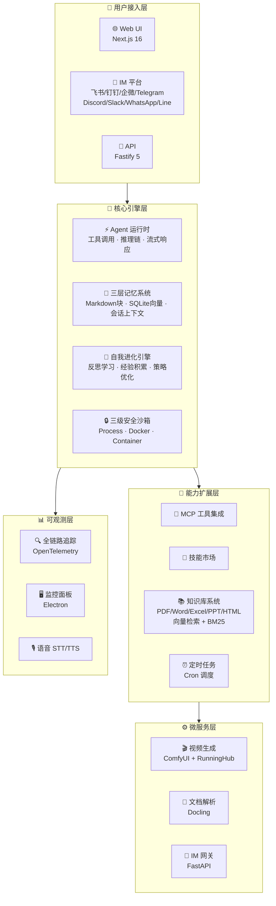
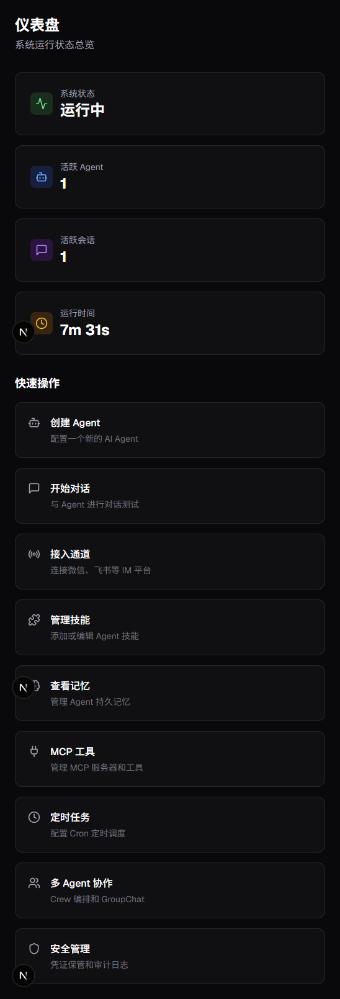
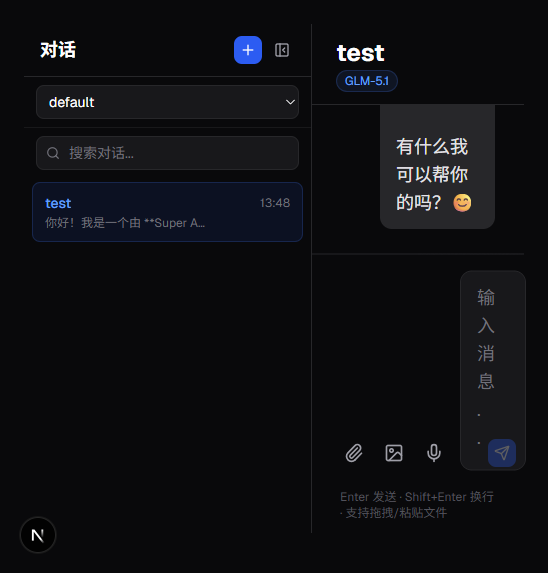

<p align="center">
  
</p>

<p align="center">
  <b>下一代模块化 AI Agent 平台</b> — 持久记忆 · 自我进化 · 多智能体协作 · 知识库 · 视频生成 · 八平台 IM 网关
</p>

<p align="center">
  <a href="https://github.com/Louis830903/Super-Loong/blob/main/LICENSE"></a>
  <a href="https://github.com/Louis830903/Super-Loong"></a>
  <a href="#"></a>
  <a href="#"></a>
  <a href="#"></a>
  <a href="#"></a>
  <a href="#"></a>
  <a href="#"></a>
  <a href="#"></a>
</p>

---

<div align="center">

```
╔══════════════════════════════════════════════════════════════╗
║  🧠 持久记忆 │ 🔄 自我进化 │ 🤝 多智能体协作 │ 📚 知识库    ║
║  🎬 视频生成 │ 💬 IM 网关 │ 🔒 安全沙箱 │ 🧩 MCP 生态  ║
╚══════════════════════════════════════════════════════════════╝
```

</div>

---

## ✨ 为什么选择 Super Agent？

Super Agent 不是又一个 AI 聊天机器人——它是一个**完整的智能体操作系统**。从持久记忆到自我进化，从多 Agent 协作到八平台 IM 接入，从知识库检索到端到端视频生成：**开箱即用，一切皆可 Agent**。



---

## 📸 预览截图

<p align="center">
  
  
</p>
<p align="center"><em>左：控制面板 · 右：智能对话</em></p>

---

## 🚀 核心能力矩阵

<table>
<tr>
<td width="50%">

### 🧠 智能体运行时
完整的 Agent 生命周期管理——工具调用、思维链推理、流式响应、上下文窗口管理。支持多轮对话、工具编排、子代理委派。

**亮点**：支持 8 大国产模型 Provider，从 Qwen 到 DeepSeek，从豆包到 Kimi，一键切换。

</td>
<td width="50%">

### 🤝 多 Agent 协作
编排器（Orchestrator）模式，支持**层级**、**并行**、**串行**三种协作拓扑。Agent 间自动路由、消息传递、结果汇聚。

**亮点**：子代理独立上下文窗口，互不干扰，并行加速。

</td>
</tr>
<tr>
<td width="50%">

### 💾 三层持久记忆
- **L1 — Markdown 块**：结构化知识持久化
- **L2 — SQLite 向量**：语义检索 + 混合搜索
- **L3 — 会话上下文**：短期记忆滑动窗口

**亮点**：跨会话知识保留，越用越懂你。

</td>
<td width="50%">

### 🔒 三级安全沙箱
- **Process 级**：子进程隔离，资源限制
- **Docker 级**：容器化执行，网络隔离
- **Container 级**：完整沙箱，文件系统隔离

**亮点**：代码执行全隔离，安全无忧。

</td>
</tr>
<tr>
<td width="50%">

### 🧬 自我进化引擎
反思学习 + 经验积累 + 策略自适应优化。Agent 从每次任务中学习，持续提升表现。

**亮点**：越用越强，像生物一样进化。

</td>
<td width="50%">

### 🧩 MCP 生态 & 技能市场
原生支持 **Model Context Protocol**（MCP）客户端，无缝对接外部工具生态。插件化技能安装、管理、版本控制。

**亮点**：无限扩展能力边界。

</td>
</tr>
<tr>
<td width="50%">

### 📚 知识库系统
支持 **PDF / Word / Excel / PPT / HTML** 全格式文档解析，**向量检索 + BM25 混合搜索**，基于 Docling 的高质量文档理解。

**亮点**：中文文档理解能力业界领先。

</td>
<td width="50%">

### 🎬 视频生成
**ComfyUI 工作流** + **RunningHub 云端模型**，端到端出片。从文案到成片，全链路自动化。

**亮点**：一句话生成专业级视频。

</td>
</tr>
<tr>
<td width="50%">

### 💬 八平台 IM 网关
| 国内平台 | 国际平台 |
|----------|----------|
| 🐦 飞书 | ✈️ Telegram |
| 📌 钉钉 | 🎮 Discord |
| 💼 企业微信 | 💬 Slack |
| | 📱 WhatsApp |
| | 📲 Line |

**亮点**：一套代码，八平台复用，消息格式自动适配。

</td>
<td width="50%">

### 📊 全链路可观测
**OpenTelemetry** 标准追踪，**Electron 桌面监控面板**，语音 **STT/TTS** 支持。请求级可观测，问题一目了然。

**亮点**：生产级可观测性，排错不抓瞎。

</td>
</tr>
</table>

---

## 🖥️ 系统操作能力

Agent 不仅仅是"聊天机器人"——它能**像真人一样操作你的电脑**，接管鼠标键盘、操控窗口、执行运维部署。

### 🖱️ 桌面精确控制

分层混合 GUI 控制引擎，**8 大核心工具**覆盖所有桌面交互场景，支持 macOS / Linux / Windows 三平台：

| 工具 | 能力 | 跨平台方案 |
|------|------|------------|
| `mouse_click` | 鼠标点击（左键/右键/中键） | macOS: `cliclick`，Linux: `xdotool`，Windows: PowerShell Win32 API |
| `mouse_move` | 鼠标移动到指定坐标 | 同上，支持绝对坐标与相对位移 |
| `mouse_drag` | 鼠标拖拽（起点→终点） | 支持拖拽文件、选区、滑块等 |
| `mouse_scroll` | 滚轮滚动（上下/左右） | 精确控制滚动步长与方向 |
| `keyboard_type` | 键盘输入文本（含中文） | 模拟逐键击键，支持 Unicode |
| `keyboard_key` | 组合键/特殊键（Ctrl+C 等） | 支持修饰键 + 功能键组合 |
| `window_focus` | 聚焦指定窗口 | 按标题/进程名匹配，自动切换焦点 |
| `window_list` | 枚举所有窗口 | 返回窗口标题 + PID + 应用名列表 |

```typescript
// 示例：Agent 自主操作桌面
await agent.use("mouse_click", { x: 500, y: 300, button: "left" });
await agent.use("keyboard_type", { text: "你好，世界！" });
await agent.use("window_focus", { title: "Visual Studio Code" });
```

### 🧠 Computer Use 视觉循环

这是 **能力天花板**——Agent 通过「截屏 → 视觉推理 → 执行操作 → 再截屏」的闭环，像人类一样**看懂屏幕并自主操作**：

```
┌──────────┐    ┌──────────┐    ┌──────────┐
│  📸 截屏  │ → │  🧠 推理  │ → │  🖱️ 执行  │
│ screen   │    │ 视觉模型  │    │ 鼠标键盘  │
│ _capture │    │ 分析画面  │    │ 操作      │
└──────────┘    └──────────┘    └──────────┘
       ↑                              │
       └──────────── 循环 ────────────┘
```

- **最大 20 步安全上限**：防止无穷循环失控
- **每步截图存档**：完整操作轨迹可回放审计
- **Feature Flag 控制**：可按需开关，避免滥用

### 📱 应用管理

跨平台应用生命周期管理，**4 个工具**搞定一切应用操作：

| 工具 | 能力 | 跨平台实现 |
|------|------|------------|
| `app_launch` | 启动应用程序 | macOS: `open -a`，Linux: `xdg-open`，Windows: `Start-Process` |
| `app_quit` | 退出应用程序 | macOS: `osascript -e 'quit app'`，Linux/Windows: `taskkill` |
| `app_list` | 列出运行中的应用 | 跨平台进程枚举 + 窗口匹配 |
| `app_switch` | 切换到指定应用 | 组合 `window_focus` + 应用激活 |

### 📸 屏幕捕获与 OCR

Agent 能「看见」屏幕上的任何内容：

| 工具 | 能力 | 说明 |
|------|------|------|
| `screen_capture` | 全屏 / 区域 / 窗口截图 | 输出 Base64 图片，直接喂给视觉模型 |
| `screen_ocr` | 屏幕文字识别 | 截图后 OCR 提取文字，用于内容识别与校验 |

### 🚀 运维部署工具链

Agent 直接接管部署流水线，从代码拉取到健康检查一气呵成：

| 工具 | 能力 | 智能策略 |
|------|------|----------|
| `deploy_git_pull` | 拉取最新代码 | 自动处理冲突、子模块更新 |
| `deploy_build` | 构建项目 | 自动检测技术栈：Node(pnpm/npm) / Python(uv/pip) / Go / Rust |
| `deploy_restart` | 重启服务 | 自动检测运行方式：pm2 / systemctl / docker |
| `deploy_rollback` | 部署回滚 | git checkout HEAD~1 / revert / 备份还原 |
| `deploy_healthcheck` | 健康检查 | HTTP curl + 进程存活双重验证 |

```bash
# Agent 一句话完成全链路部署
deploy_git_pull → deploy_build → deploy_restart → deploy_healthcheck ✅
```

### 🐳 Docker 容器管理

完整容器生命周期管理，同时兼容 **Docker** 和 **Podman**：

| 工具 | 能力 |
|------|------|
| `docker_ps` | 容器列表 + 状态 + 资源占用 |
| `docker_logs` | 实时/历史日志查看 |
| `docker_exec` | 容器内执行命令 |
| `docker_lifecycle` | 启动 / 停止 / 重启 / 删除容器 |
| `docker_images` | 镜像列表 + 清理 |
| `docker_compose` | `docker compose up/down/ps/logs` 一键编排 |

### 🌐 网络诊断工具组

网络排障一站通，**5 个经典诊断工具**内置：

| 工具 | 能力 | 场景 |
|------|------|------|
| `net_ping` | ICMP 连通性测试 | 判断主机是否可达 |
| `net_traceroute` | 路由追踪 | 定位网络瓶颈在哪一跳 |
| `net_ports` | 端口占用检测 (`ss`/`lsof`) | 排查端口冲突 |
| `net_dns` | DNS 解析 (`nslookup`) | 域名解析问题排查 |
| `net_curl` | HTTP 请求测试 | 接口连通性 + 响应内容检查 |

### ⚙️ 服务与定时任务

系统级服务管理，支持 macOS(`launchctl`) / Linux(`systemctl`) / Windows(`Get-Service`)：

| 工具 | 能力 |
|------|------|
| `service_status` | 查看服务运行状态 |
| `service_control` | 启动 / 停止 / 重启系统服务 |
| `service_logs` | 查看服务日志 |
| `cron_manage` | 定时任务管理（crontab / launchd / Task Scheduler） |

> **一句话总结**：从鼠标键盘到 Docker 部署，从截屏 OCR 到网络诊断——Super Agent 具备**完整的生产级电脑操控能力**，是真正的「数字员工」而非聊天玩具。

---

## ⚡ 一键启动

### 📋 环境要求

| 依赖 | 版本 | 说明 |
|------|------|------|
|  | ≥ 20.0.0 | 运行时 |
|  | ≥ 9.0.0 | 包管理 |
|  | ≥ 3.11 | 知识库 / IM / 视频 |
|  | 最新 | Python 依赖管理 |

### 🪄 三步起飞

```bash
# ① 克隆并进入
git clone https://github.com/Louis830903/Super-Loong.git && cd Super-Loong

# ② 一键初始化（依赖安装 + 配置生成 + Python 服务自举）
pnpm setup

# ③ 编辑 .env 填入 API Key，然后启动
pnpm dev
```

<div align="center">

| 服务 | 地址 | 说明 |
|------|------|------|
| 🌐 **Web UI** | http://localhost:3000 | 对话 / Agent 管理 / 知识库 |
| 🔌 **API** | http://localhost:3001 | RESTful API 服务 |
| 🌉 **IM 网关** | http://localhost:8642 | 八平台消息接入 |
| 🖥️ **监控面板** | Electron 窗口 | 桌面级实时监控 |

</div>

> 💡 **零配置哲学**：`pnpm setup` 自动完成一切——加密密钥生成、Node.js 依赖安装、IM Gateway 的 Python venv 创建。`pnpm dev` 启动后，video-forge（视频生成）、im-gateway（IM 网关）自动拉起，kb-parser（知识库解析）首次使用时懒启动。**三个 Python 微服务，零手动配置**。

---

## 🏗️ 架构一览

```
super-agent/                        # 📦 Monorepo 根
│
├── 📁 packages/                    # TypeScript 包
│   ├── 🧠 core/                    #   核心引擎：Agent 运行时 · 记忆 · 进化 · 安全
│   ├── 🔌 api/                     #   Fastify 5 API 服务
│   ├── 🌐 web/                     #   Next.js 16 前端（14 页面）
│   ├── 🖥️ monitor/                 #   Electron 桌面监控面板
│   ├── 🔬 research/                #   评估基准与学术研究
│   └── 📐 web-types/               #   前后端共享类型与常量
│
├── 📁 services/                    # Python 微服务
│   ├── 🌉 im-gateway/              #   八平台 IM 适配网关（FastAPI）
│   ├── 🎬 video-forge/             #   视频生成引擎（ComfyUI）
│   └── 📄 kb-parser/               #   文档解析服务（Docling）
│
├── 📁 data/                        # 运行时数据（不入库）
├── 📁 docs/                        # 项目文档
├── ⚙️ .env.example                 # 环境变量模板
└── 📜 package.json                 # Monorepo 入口
```

---

## 🎯 模型 Provider 矩阵

<table>
<tr>
<td align="center" width="25%">
  <b>☁️ 阿里 DashScope</b><br/>
  <sub>Qwen 全系列 · 多模态</sub>
</td>
<td align="center" width="25%">
  <b>🔍 DeepSeek</b><br/>
  <sub>V3 / R1 · 深度推理</sub>
</td>
<td align="center" width="25%">
  <b>🧠 智谱 GLM</b><br/>
  <sub>GLM-4.7 · 国产旗舰</sub>
</td>
<td align="center" width="25%">
  <b>🌙 Moonshot</b><br/>
  <sub>Kimi K2.5 · 超长上下文</sub>
</td>
</tr>
<tr>
<td align="center" width="25%">
  <b>🌋 火山方舟</b><br/>
  <sub>豆包 Seed 2.0 · 图片生成</sub>
</td>
<td align="center" width="25%">
  <b>✨ MiniMax</b><br/>
  <sub>多模态理解与生成</sub>
</td>
<td align="center" width="25%">
  <b>🤖 OpenAI</b><br/>
  <sub>GPT 系列 · 可选</sub>
</td>
<td align="center" width="25%">
  <b>🏠 Ollama</b><br/>
  <sub>本地模型 · 离线运行</sub>
</td>
</tr>
</table>

---

## ⚙️ 开发指南

```bash
pnpm install      # 安装依赖
pnpm dev          # 开发模式（全服务热重载）
pnpm build        # 生产构建
pnpm test         # 运行测试
pnpm lint         # 代码检查
pnpm clean        # 清理构建产物
```

<details>
<summary>🔧 按模块启动（高级）</summary>

```bash
pnpm dev:api       # 仅启动 API 服务
pnpm dev:web       # 仅启动 Web UI
pnpm dev:monitor   # 仅启动监控面板
pnpm dev:gateway   # 仅启动 IM 网关
```

</details>

---

## 📜 开源协议

Super Agent 采用 **MIT License** —— 业界最宽松的开源协议之一，在**保留版权声明**的前提下，赋予你最大的使用自由。

### 你拥有以下权利

| 权利 | 说明 |
|------|------|
| 🆓 **免费商用** | 可用于商业项目、SaaS 产品、企业内部工具，无需付费 |
| ✂️ **自由修改** | 可以修改、定制、二次开发，无需公开你的改动 |
| 📦 **自由分发** | 可以作为独立产品或嵌入到你的项目中分发 |
| 🔗 **闭源使用** | 修改后的代码可以选择不开源，没有 "传染性" Copyleft 限制 |
| 🔀 **子许可** | 可以在你的产品中以其他协议重新许可 |

### 你需要注意

| 注意事项 | 说明 |
|----------|------|
| 📋 **保留版权声明** | 分发时需保留原始 MIT License 声明和版权信息 |
| ⚠️ **无担保** | 软件按"原样"提供，作者不承担任何质量或适用性担保 |
| 🛡️ **无责任** | 因使用本软件产生的任何损失，作者不承担法律责任 |

### 第三方依赖

本项目依赖的第三方库（React、Next.js、Fastify、Python 生态等）遵循各自的许可证。使用前请确认各依赖的许可证条款与你的用途兼容。

### 全文

完整许可证文本请参阅 [LICENSE](LICENSE) 文件。

```
MIT License

Copyright (c) 2026 Louis830903

Permission is hereby granted, free of charge, to any person obtaining a copy
of this software and associated documentation files (the "Software"), to deal
in the Software without restriction, including without limitation the rights
to use, copy, modify, merge, publish, distribute, sublicense, and/or sell
copies of the Software, and to permit persons to whom the Software is
furnished to do so, subject to the following conditions:

The above copyright notice and this permission notice shall be included in all
copies or substantial portions of the Software.

THE SOFTWARE IS PROVIDED "AS IS", WITHOUT WARRANTY OF ANY KIND...
```

---

## 🤝 贡献

欢迎提交 Issue、PR 或 Star ⭐！

<div align="center">

**[📖 文档](docs/)** · **[🐛 报告问题](https://github.com/Louis830903/Super-Loong/issues)** · **[💡 功能建议](https://github.com/Louis830903/Super-Loong/issues)**

<sub>Made with ❤️ by the Super Agent Team</sub>

</div>
