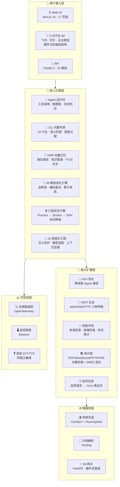

<p align="center">
  
</p>

<p align="center">
  <b>下一代模块化 AI Agent 平台</b><br/>
  <sub>🧠 211 内置专家 · 🔮 HRR 向量记忆 · 🕸️ 知识图谱推理 · 🤝 A2A 跨进程通信 · 🧬 34 模块进化引擎 · 💬 三大平台 IM · 🎬 端到端视频生成 · 🖱️ 桌面操控</sub>
</p>

<p align="center">
  <a href="https://github.com/Louis830903/Super-Loong/stargazers"></a>
  <a href="https://github.com/Louis830903/Super-Loong/network/members"></a>
  <a href="https://github.com/Louis830903/Super-Loong/blob/main/LICENSE"></a>
  <a href="https://github.com/Louis830903/Super-Loong"></a>
  <a href="https://github.com/Louis830903/Super-Loong"></a>
</p>

<p align="center">
  
  
  
  
  
  
  
  
  
</p>

---

<div align="center">

```
╔══════════════════════════════════════════════════════════════════════╗
║  🧠 211 内置专家 │ 🔮 HRR 向量记忆 │ 🕸️ 知识图谱推理 │ 💬 三大平台 IM ║
║  🤝 A2A 协议 │ 🧬 34 模块进化引擎 │ 🔒 三级沙箱 │ 🎬 端到端视频生成  ║
╚══════════════════════════════════════════════════════════════════════╝
```

</div>

---

## ✨ 为什么选择 Super Agent？

Super Agent 不是又一个 AI 聊天机器人——它是**全球唯一同时具备「桌面操控 + 211 专家 + 三平台 IM + 源码级自进化」的生产级智能体操作系统**。

> **只此一家，别无分店：**
> - 🖱️ **真正操控电脑**：鼠标键盘、桌面窗口、截屏 OCR——不是"建议"而是"执行"
> - 🧠 **211 个专家不糊弄**：每个是完整 System Prompt + Toolset，不是关键词匹配
> - 🔮 **HRR 代数向量记忆**：能做绑定/解绑/叠加运算，不是 cos-sim 玩具
> - 🧬 **Agent 自己写代码改进自己**：34 模块进化引擎，源码级自修改（targetCode + diff + 沙箱验证）
> - 💬 **一套代码通三平台**：飞书/钉钉/企业微信，插件式热插拔无缝接入
> - 🎬 **一句话出片**：ComfyUI 工作流 + RunningHub，从文案到成片全自动
> - 🛒 **电商运营自动化**：微信小店 + 抖音小店双平台，商品管理/订单发货/日常巡检

### 🤖 数字员工实战

把 Agent 当成真正的数字员工——**一句话，全自动搞定**：

| 你只需要说... | Agent 自动完成... |
|-------------|------------------|
| 🗂️ "把这个文件夹的 PDF 全转成 Markdown，导入知识库" | PDF 解析 → OCR → 格式化 → 向量化入库 |
| 💬 "打开飞书，给 @张三 发消息说部署完成" | 操控飞书 → 定位聊天窗口 → 发送消息 |
| 🔍 "检查服务器 8080 端口，如果被占用就杀进程并重启" | 网络诊断 → 进程管理 → 部署重启 |
| 🎬 "生成一段 30 秒产品介绍视频，配上背景音乐" | 写文案 → 调 ComfyUI 工作流 → 渲染 → 合成 BGM |
| 🐳 "把这个 Next.js 项目 Docker 化并推到服务器部署" | 写 Dockerfile → 构建镜像 → 推送到服务器 → 拉起容器 |
| 📊 "每天下午 6 点自动抓 GitHub Star 数，发到企微群" | 定时任务 → HTTP 请求 → 企微 Webhook 发送 |
| 🛒 "帮我在微信小店后台批量上架这 20 个新品" | 浏览器自动登录 → 填写商品信息 → 批量上架 → 回报结果 |
| 🧬 "分析最近的代码改动，生成改进提案并 diff 对比" | 代码分析 → LLM 审查 → targetCode 提案 → before/after diff → 提交审核 |

**开箱即用，一切皆可 Agent。**



---

## 🚀 核心能力矩阵

<table>
<tr>
<td width="50%">

### 🧠 211 内置专家 Agent
16 个行业、211 个领域专家开箱即用——从金融风控到游戏开发，从法律文档到供应链优化。**Hierarchical 智能分配**自动语义匹配最合适的专家处理任务，A2A 协议实现跨专家协作。

**炸裂点**：不是「配置 211 个选项」，而是实打实的 211 套独立 System Prompt + Toolset。**一个任务来了，自动找到最对口的专家接手**——金融问题不会让码农专家回答。

</td>
<td width="50%">

### 🤝 多 Agent 协作 + A2A 协议
**层级/并行/串行**三种协作拓扑 + **Google A2A 协议**跨进程通信。Agent 间自动路由、任务委托、结果汇聚。远程 Agent 透明调用，像本地一样简单。

**炸裂点**：子代理独立上下文窗口 + A2A 跨进程发现，分布式 Agent 网络。

</td>
</tr>
<tr>
<td width="50%">

### 🔮 HRR 向量记忆 + 知识图谱
**HRR 全息相位向量**实现符号级记忆绑定/解绑操作，而非简单的余弦相似度。**知识图谱** RDF 三元组 + 传递闭包推理（`parentOf → ancestorOf`）。**FTS5 全文搜索**中英文混合。

**炸裂点**：不只是"向量搜索"，是真正的符号推理级记忆。

</td>
<td width="50%">

### 📝 10 层提示工程
L1-L6 静态缓存层（系统身份/安全策略/记忆/技能）+ L7-L10 动态注入层（上下文压缩/平台适配/跨语言翻译）。**注入防护**自动清洗恶意 prompt，**模型适配器**为每个模型调整格式。

**炸裂点**：工业级提示词工程，而非一个 `system: "你是..."` 完事。

</td>
</tr>
<tr>
<td width="50%">

### 🧬 双引擎自我进化（Phase 2 全面落地）
**Nudge 反思引擎**：每次对话后自动反思，提取洞察，优化策略。**进化引擎 Phase 2**：34 个进化模块全面落地——自适应执行器动态调整策略、自动学习器从交互中提取可复用模式、**源码级自修改引擎**（LLM 分析代码缺陷 → 产出 targetCode 提案 → before/after diff 对比 → 沙箱验证后应用）、编码委派器智能分配编码任务给子代理、意图分解器 + 策略学习器自动优化任务处理路径。20+ 算子体系（base/recombination/refinement/revision）驱动技能自动进化，质量关卡 + 审计 + 预算控制确保安全放权。

**炸裂点**：不仅是「生成技能文件」——Agent 能**自己写代码改进自己**，有 diff 对比、沙箱验证、人工审批三道关卡，渐进式自动化放权。

</td>
<td width="50%">

### 🔒 三级安全沙箱
**Process → Docker → SSH** 三级自动降级。`CredentialVault` AES-256 加密密钥库，`TokenProxy` 代理敏感凭证。**危险命令实时拦截**：`rm -rf`、`sudo`、`curl|bash` 等 50+ 模式。

**炸裂点**：代码执行全覆盖，危险操作 0 容忍。

</td>
</tr>
<tr>
<td width="50%">

### 💬 三大平台 IM 网关
| 国内平台 | 说明 |
|----------|------|
| 🐦 飞书 | 已对接，消息/卡片/文件全支持 |
| 📌 钉钉 | OAuth 2.0 新 API 升级完成 |
| 💼 企业微信 | 已对接，消息收发畅通 |

**插件式热插拔架构**——钉钉已升级 OAuth 2.0 新 API，对标 jiuwenclaw 参考实现。

**炸裂点**：一套代码三平台复用，消息格式自动适配，渠道零耦合。

</td>
<td width="50%">

### 🎬 端到端视频生成
**ComfyUI 工作流** + **RunningHub 云端模型**，从文案到成片全链路自动化。视频 Crew 专用编排（7 文件 ~2300 行），多 Agent 协同出片。

**炸裂点**：一句话生成专业级视频，Agent 自己当导演。

</td>
</tr>
<tr>
<td width="50%">

### 🧩 MCP 生态 & 技能市场
**stdio/SSE/HTTP** 三种 MCP 传输，Bearer/API-Key/Basic 认证。技能市场**多源安装**（GitHub/SkillHub/ClawHub/Local），**就绪检查**校验依赖/密钥/信任等级，**安全审计引擎**扫描恶意代码。

**炸裂点**：安装技能前自动安全检查，不是无脑装。

</td>
<td width="50%">

### 📚 知识库 + 定时任务 + 全链路追踪
知识库支持 10+ 文件格式，BM25 + 向量混合检索。**自然语言 → Cron 表达式**（LLM 翻译）。**OpenTelemetry** 全链路追踪，**20+ 工具分类**覆盖文件/桌面/运维/浏览器/Git/视频。**Electron 独立监控窗口**实时查看 Agent 状态。

**炸裂点**：知识入库 → Agent 决策 → 定时执行 → 全链路追踪——从「知道」到「做到」到「回溯」完整闭环。

</td>
</tr>
</table>

---

## 📊 平台规模一览

| 维度 | 数字 | 说明 |
|------|:--:|------|
| 🧠 内置专家 Agent | **211** | 16 个行业，从金融到供应链 |
| 🔌 API 路由 | **22** | Fastify 5 全 RESTful |
| 🌐 Web 页面 | **17** | Next.js 16 全功能面板 |
| 💬 IM 渠道 | **3** | 飞书/钉钉/企业微信，插件式热插拔 |
| 🔧 内置工具 | **36** | 文件/桌面/运维/Docker/Git/浏览器/视频/安全 |
| 🧬 进化模块 | **34** | 自适应执行器 · 自修改引擎 · 算子体系 · 质量关卡 |
| 📄 知识库格式 | **10+** | PDF/Word/Excel/PPT/Markdown/HTML/EPUB/CSV/JSON |
| 🏭 微服务 | **4** | IM 网关 · 视频引擎 · 文档解析器 · 定时任务调度 |
| 🔒 沙箱层级 | **3** | Process → Docker → SSH 自动降级 |
| 📝 提示层级 | **10** | L1-L6 缓存 + L7-L10 动态注入 |
| 💾 持久化表 | **6** | SQLite WAL，配置持久化加密存储 |
| 📦 核心代码 | **~40K+ 行** | TypeScript (~4M 含 node_modules) + Python IM 网关 |

> 这不是一个 Demo——这是**生产级智能体操作系统**。

---

## 🆚 为什么不是其他平台？

不是说竞品不好——而是 **Super Agent 做到了别人没做到的事**：

| 能力维度 | Super Agent | Claude Code / Cursor | Coze / Dify | AutoGPT / crewAI |
|----------|:-----------:|:---------------------:|:-----------:|:----------------:|
| 🖱️ **桌面操控** | ✅ 鼠键+截屏+窗口 | ❌ | ❌ | ❌ |
| 🧠 **内置专家** | ✅ **211 个开箱即用** | ❌ 需手动配置 | ⚠️ 可视化编排 | ⚠️ 需手写 Agent |
| 🔮 **记忆系统** | ✅ HRR 代数向量+知识图谱 | ⚠️ 仅对话上下文 | ⚠️ 基础向量库 | ⚠️ 依赖外部 |
| 🧬 **自我进化** | ✅ 自动生成技能文件热加载 | ❌ | ❌ | ❌ |
| 💬 **IM 集成** | ✅ **飞书/钉钉/企微 原生适配** | ❌ | ⚠️ 需插件 | ❌ |
| 🎬 **视频生成** | ✅ ComfyUI 端到端 | ❌ | ❌ | ❌ |
| 🔒 **安全沙箱** | ✅ **三级降级+50+危险拦截** | ⚠️ 基础沙箱 | ❌ | ❌ |
| 🤝 **A2A 协议** | ✅ 跨进程 Agent 通信 | ❌ | ❌ | ❌ |
| 🧩 **MCP 生态** | ✅ stdio/SSE/HTTP+安全审计 | ✅ stdio | ⚠️ 插件市场 | ❌ |
| 🏗️ **部署形态** | ✅ **独立运行，自建服务** | ✅ 编辑器插件 | ⚠️ SaaS 锁定 | ⚠️ 纯框架 |

> **一句话：Super Agent 是「有手的 AI」**——能聊天、能操作电脑、能管部署、能出视频。别的平台是「大脑」，Super Agent 是「大脑 + 双手」。

---

## 📈 Star 趋势

<p align="center">
  <a href="https://star-history.com/#Louis830903/Super-Loong&Date">
    
  </a>
</p>

---

## 🗺️ 路线图

| 阶段 | 状态 | 内容 |
|------|:----:|------|
| 🏗️ **v0.1 Alpha** | ✅ 已完成 | 核心运行时 + 211 专家 + 记忆系统 + 三平台 IM + 安全沙箱 + MCP 生态 + 技能市场 |
| 🚀 **v0.2 Beta** | ✅ 已完成 | 进化引擎 Phase 2（34 个模块）· 自修改引擎 · 编码委派 · FTS5 原生支持 · A2A 跨进程打通 · 电商运营技能 · 进化 UI 完善 |
| 🎯 **v0.5 里程碑** | 🔨 进行中 | 多模态 Agent 打通 · 视频生成端到端出片 · 分布式 Agent 协作 · SSE 流稳定性 |
| 🌟 **v1.0 正式版** | 📋 规划中 | 插件市场 · 云端一键部署 · Agent 商店 · 企业级权限系统 · 社区贡献生态 |

---

## 🖥️ 系统操作能力 —— 你真正的数字员工

> **这是 Super Agent 与所有其他 Agent 平台的终极分水岭。**

Agent 不仅仅是"聊天机器人"——它能**像真人一样操作你的电脑**，接管鼠标键盘、操控窗口、执行运维部署。**有手、有眼、有判断力**。

```typescript
// Agent 不只是回复文字——它直接动手
"帮我在 VS Code 里打开这个项目，然后 npm install"
→ window_focus("VS Code") → keyboard_type("code .\n") → run_shell("npm install")
// 全部自动完成，你只需看着
```

### 🖱️ 桌面精确控制

分层混合 GUI 控制引擎，**8 大核心工具**覆盖所有桌面交互场景，支持 macOS / Linux / Windows 三平台：

| 工具 | 能力 | 跨平台方案 |
|------|------|------------|
| `mouse_click` | 鼠标点击（左键/右键/中键） | macOS: `cliclick`，Linux: `xdotool`，Windows: PowerShell Win32 API |
| `mouse_move` | 鼠标移动到指定坐标 | 同上，支持绝对坐标与相对位移 |
| `mouse_drag` | 鼠标拖拽（起点→终点） | 支持拖拽文件、选区、滑块等 |
| `mouse_scroll` | 滚轮滚动（上下/左右） | 精确控制滚动步长与方向 |
| `keyboard_type` | 键盘输入文本（含中文） | 模拟逐键击键，支持 Unicode |
| `keyboard_key` | 组合键/特殊键（Ctrl+C 等） | 支持修饰键 + 功能键组合 |
| `window_focus` | 聚焦指定窗口 | 按标题/进程名匹配，自动切换焦点 |
| `window_list` | 枚举所有窗口 | 返回窗口标题 + PID + 应用名列表 |

```typescript
// 示例：Agent 自主操作桌面
await agent.use("mouse_click", { x: 500, y: 300, button: "left" });
await agent.use("keyboard_type", { text: "你好，世界！" });
await agent.use("window_focus", { title: "Visual Studio Code" });
```

### 🧠 Computer Use 视觉循环

这是 **能力天花板**——Agent 通过「截屏 → 视觉推理 → 执行操作 → 再截屏」的闭环，像人类一样**看懂屏幕并自主操作**：

```
┌──────────┐    ┌──────────┐    ┌──────────┐
│  📸 截屏  │ → │  🧠 推理  │ → │  🖱️ 执行  │
│ screen   │    │ 视觉模型  │    │ 鼠标键盘  │
│ _capture │    │ 分析画面  │    │ 操作      │
└──────────┘    └──────────┘    └──────────┘
       ↑                              │
       └──────────── 循环 ────────────┘
```

- **最大 20 步安全上限**：防止无穷循环失控
- **每步截图存档**：完整操作轨迹可回放审计
- **Feature Flag 控制**：可按需开关，避免滥用

### 📱 应用管理

跨平台应用生命周期管理，**4 个工具**搞定一切应用操作：

| 工具 | 能力 | 跨平台实现 |
|------|------|------------|
| `app_launch` | 启动应用程序 | macOS: `open -a`，Linux: `xdg-open`，Windows: `Start-Process` |
| `app_quit` | 退出应用程序 | macOS: `osascript -e 'quit app'`，Linux/Windows: `taskkill` |
| `app_list` | 列出运行中的应用 | 跨平台进程枚举 + 窗口匹配 |
| `app_switch` | 切换到指定应用 | 组合 `window_focus` + 应用激活 |

### 📸 屏幕捕获与 OCR

Agent 能「看见」屏幕上的任何内容：

| 工具 | 能力 | 说明 |
|------|------|------|
| `screen_capture` | 全屏 / 区域 / 窗口截图 | 输出 Base64 图片，直接喂给视觉模型 |
| `screen_ocr` | 屏幕文字识别 | 截图后 OCR 提取文字，用于内容识别与校验 |

### 🚀 运维部署工具链

Agent 直接接管部署流水线，从代码拉取到健康检查一气呵成：

| 工具 | 能力 | 智能策略 |
|------|------|----------|
| `deploy_git_pull` | 拉取最新代码 | 自动处理冲突、子模块更新 |
| `deploy_build` | 构建项目 | 自动检测技术栈：Node(pnpm/npm) / Python(uv/pip) / Go / Rust |
| `deploy_restart` | 重启服务 | 自动检测运行方式：pm2 / systemctl / docker |
| `deploy_rollback` | 部署回滚 | git checkout HEAD~1 / revert / 备份还原 |
| `deploy_healthcheck` | 健康检查 | HTTP curl + 进程存活双重验证 |

```bash
# Agent 一句话完成全链路部署
deploy_git_pull → deploy_build → deploy_restart → deploy_healthcheck ✅
```

### 🐳 Docker 容器管理

完整容器生命周期管理，同时兼容 **Docker** 和 **Podman**：

| 工具 | 能力 |
|------|------|
| `docker_ps` | 容器列表 + 状态 + 资源占用 |
| `docker_logs` | 实时/历史日志查看 |
| `docker_exec` | 容器内执行命令 |
| `docker_lifecycle` | 启动 / 停止 / 重启 / 删除容器 |
| `docker_images` | 镜像列表 + 清理 |
| `docker_compose` | `docker compose up/down/ps/logs` 一键编排 |

### 🌐 网络诊断工具组

网络排障一站通，**5 个经典诊断工具**内置：

| 工具 | 能力 | 场景 |
|------|------|------|
| `net_ping` | ICMP 连通性测试 | 判断主机是否可达 |
| `net_traceroute` | 路由追踪 | 定位网络瓶颈在哪一跳 |
| `net_ports` | 端口占用检测 (`ss`/`lsof`) | 排查端口冲突 |
| `net_dns` | DNS 解析 (`nslookup`) | 域名解析问题排查 |
| `net_curl` | HTTP 请求测试 | 接口连通性 + 响应内容检查 |

### ⚙️ 服务与定时任务

系统级服务管理，支持 macOS(`launchctl`) / Linux(`systemctl`) / Windows(`Get-Service`)：

| 工具 | 能力 |
|------|------|
| `service_status` | 查看服务运行状态 |
| `service_control` | 启动 / 停止 / 重启系统服务 |
| `service_logs` | 查看服务日志 |
| `cron_manage` | 定时任务管理（crontab / launchd / Task Scheduler） |

> **一句话总结**：从鼠标键盘到 Docker 部署，从截屏 OCR 到网络诊断——Super Agent 具备**完整的生产级电脑操控能力**。别的 Agent 只能「回复文字」，Super Agent 能「上手干活」。这才是真正的「数字员工」，不是聊天玩具。

---

## ⚡ 快速开始

### 📋 环境要求

#### 硬件要求

| 级别 | CPU | 内存 | 磁盘 | 说明 |
|------|-----|------|------|------|
| **最小** | 2 核 | 4 GB | 2 GB | 基础对话功能，不含视频/Docker |
| **推荐** | 4 核 | 8 GB | 10 GB SSD | 全功能流畅运行 |
| **最优** | 8 核+ | 16 GB+ | 50 GB+ SSD | 多 Agent 协作 + 视频生成 + 知识库 |

> 💡 **LLM 推理不占本地资源**——所有模型调用走云端 API（DashScope / DeepSeek / 智谱等），这是最大成本节省。仅当本地跑 Ollama 时才需 GPU（建议 8 GB+ 显存）。

#### 软件依赖

| 依赖 | 版本 | 说明 | 安装方式 |
|------|------|------|----------|
|  | ≥ 20.0.0 | TypeScript 运行时 | `nvm install 20` 或 [nodejs.org](https://nodejs.org) |
|  | ≥ 9.0.0 | Monorepo 包管理 | `npm i -g pnpm` 或 `corepack enable` |
|  | ≥ 3.11 | IM 网关 / 视频生成 / 文档解析 | [python.org](https://python.org) 或 `pyenv` |
|  | 最新 | Python 依赖管理（替代 pip） | `pip install uv` 或 [astral.sh](https://astral.sh) |
|  | ≥ 2.40 | 版本管理 | [git-scm.com](https://git-scm.com) |

#### LLM API Key（至少配置一个）

| 提供商 | 环境变量 | 获取地址 |
|--------|----------|----------|
| 阿里 DashScope | `DASHSCOPE_API_KEY` | [dashscope.aliyun.com](https://dashscope.aliyun.com) |
| DeepSeek | `DEEPSEEK_API_KEY` | [platform.deepseek.com](https://platform.deepseek.com) |
| 智谱 GLM | `ZHIPU_API_KEY` | [open.bigmodel.cn](https://open.bigmodel.cn) |
| Moonshot (Kimi) | `MOONSHOT_API_KEY` | [platform.moonshot.cn](https://platform.moonshot.cn) |
| 火山方舟 | `ARK_API_KEY` | [console.volcengine.com](https://console.volcengine.com/ark) |
| MiniMax | `MINIMAX_API_KEY` | [platform.minimaxi.com](https://platform.minimaxi.com) |
| OpenAI（可选） | `OPENAI_API_KEY` | [platform.openai.com](https://platform.openai.com) |
| Ollama（本地） | 自动检测 `http://127.0.0.1:11434` | `ollama pull qwen3` |

### 🪄 安装步骤

<details open>
<summary><b>Windows（你在用的系统）</b></summary>

```powershell
# ① 克隆仓库
git clone https://github.com/Louis830903/Super-Loong.git
cd Super-Loong

# ② 安装 Node.js 依赖
pnpm install

# ③ 安装 IM 网关 Python 依赖
cd services/im-gateway
uv sync  # 或: pip install -e .
cd ../..

# ④ 复制环境变量模板并编辑
copy .env.example .env
# 用记事本打开 .env，至少填入一个 API Key（如 DASHSCOPE_API_KEY）
notepad .env

# ⑤ 启动！
pnpm dev
```

> ⚠️ **Windows 用户注意**：PowerShell 不支持 `&&` 作为语句分隔符，请逐行执行或用 `;` 代替。

启动后访问：

| 服务 | 地址 | 说明 |
|------|------|------|
| 🌐 **Web UI** | http://localhost:3000 | 对话 / Agent 管理 / 知识库 / 进化引擎 |
| 🔌 **API** | http://localhost:3001 | RESTful API 服务（Fastify 5） |
| 🌉 **IM 网关** | http://localhost:8642 | 飞书/钉钉/企微消息接入（FastAPI） |
| 🖥️ **监控面板** | Electron 窗口 | 桌面级实时监控（自动弹出） |
| 🎬 **视频引擎** | http://localhost:8199 | 视频生成（按需启动） |

</details>

<details>
<summary><b>macOS / Linux</b></summary>

```bash
# ① 克隆仓库
git clone https://github.com/Louis830903/Super-Loong.git && cd Super-Loong

# ② 一键初始化（依赖安装 + 配置生成 + Python 服务自举）
pnpm setup

# ③ 编辑 .env 填入 API Key
nano .env
# 或者: vim .env / code .env

# ④ 启动
pnpm dev
```

启动后访问：http://localhost:3000

</details>

### 🔧 配置说明

`.env` 文件核心配置项：

```bash
# === 必填：加密密钥（自动生成 64 位 hex）===
SA_ENCRYPTION_KEY=        # 首次运行时自动生成，也可手动：openssl rand -hex 32

# === 必填：至少配置一个 LLM Provider ===
DASHSCOPE_API_KEY=        # 阿里 DashScope（推荐，Qwen 系列性价比最高）
DEEPSEEK_API_KEY=          # DeepSeek V3/R1
ZHIPU_API_KEY=             # 智谱 GLM-4.7

# === 可选：视频生成（需要 RunningHub 账号）===
RUNNINGHUB_API_KEY=        # https://www.runninghub.com 注册获取
VIDEO_FORGE_URL=http://127.0.0.1:8199

# === 可选：IM 网关（飞书/钉钉/企微）===
# 飞书: 在飞书开放平台创建应用，获取 App ID + App Secret
# 钉钉: 在钉钉开放平台创建应用，获取 Client ID + Client Secret  
# 企微: 在企业微信管理后台获取 Corp ID + Secret
# 详细配置见 services/im-gateway/.env.example
```

### ✅ 验证安装

```bash
# 检查 API 服务是否正常
curl http://localhost:3001/api/health
# 预期返回: {"status":"ok","uptime":...}

# 检查 Web 前端是否正常
curl -s -o /dev/null -w "%{http_code}" http://localhost:3000
# 预期返回: 200
```

### ⚠️ 常见问题

<details>
<summary><b>Q: 启动报错 "SA_ENCRYPTION_KEY is required"</b></summary>

编辑 `.env` 文件，设置 `SA_ENCRYPTION_KEY`（64 位 hex）。生成方式：

```bash
# 方式一（推荐）
openssl rand -hex 32

# 方式二（Node.js）
node -e "console.log(require('crypto').randomBytes(32).toString('hex'))"
```

</details>

<details>
<summary><b>Q: pnpm install 很慢 / 报网络错误</b></summary>

国内用户建议配置镜像源：

```bash
pnpm config set registry https://registry.npmmirror.com
```

</details>

<details>
<summary><b>Q: Python 依赖安装失败（uv sync 报错）</b></summary>

确保 Python ≥ 3.11，然后重试：

```bash
python --version  # 确认版本
cd services/im-gateway
uv venv            # 创建虚拟环境
uv sync            # 安装依赖
```

如果 `uv` 不可用，改用 pip：

```bash
pip install -e services/im-gateway/
```

</details>

<details>
<summary><b>Q: 端口被占用（3000 / 3001 / 8642）</b></summary>

```powershell
# Windows — 查找并结束占用进程
netstat -ano | findstr :3000
taskkill /PID <PID> /F

# macOS/Linux — 查找并结束占用进程
lsof -i :3000
kill -9 <PID>
```

</details>

<details>
<summary><b>Q: 飞书/钉钉/企微 IM 网关怎么配置？</b></summary>

详见 `services/im-gateway/` 目录下的各个渠道配置文档。飞书需要：

1. 在[飞书开放平台](https://open.feishu.cn)创建企业自建应用
2. 开启「机器人」能力，配置事件订阅地址为 `https://你的域名:8642/feishu/event`
3. 将 App ID / App Secret 填入 IM 网关对应的 `.env` 文件

</details>

---

## 🏗️ 架构一览

```
super-agent/                        # 📦 Monorepo 根
│
├── 📁 packages/                    # TypeScript 包
│   ├── 🧠 core/                    #   核心引擎：Agent 运行时 · 记忆 · 进化 · 安全
│   ├── 🔌 api/                     #   Fastify 5 API 服务
│   ├── 🌐 web/                     #   Next.js 16 前端（14 页面）
│   ├── 🖥️ monitor/                 #   Electron 桌面监控面板
│   ├── 🔬 research/                #   评估基准与学术研究
│   └── 📐 web-types/               #   前后端共享类型与常量
│
├── 📁 services/                    # Python 微服务
│   ├── 🌉 im-gateway/              #   三平台 IM 适配网关（FastAPI）
│   ├── 🎬 video-forge/             #   视频生成引擎（ComfyUI）
│   └── 📄 kb-parser/               #   文档解析服务（Docling）
│
├── 📁 data/                        # 运行时数据（不入库）
├── 📁 docs/                        # 项目文档
├── ⚙️ .env.example                 # 环境变量模板
└── 📜 package.json                 # Monorepo 入口
```

---

## 🎯 模型 Provider 矩阵

<table>
<tr>
<td align="center" width="25%">
  <b>☁️ 阿里 DashScope</b><br/>
  <sub>Qwen 全系列 · 多模态</sub>
</td>
<td align="center" width="25%">
  <b>🔍 DeepSeek</b><br/>
  <sub>V3 / R1 · 深度推理</sub>
</td>
<td align="center" width="25%">
  <b>🧠 智谱 GLM</b><br/>
  <sub>GLM-4.7 · 国产旗舰</sub>
</td>
<td align="center" width="25%">
  <b>🌙 Moonshot</b><br/>
  <sub>Kimi K2.5 · 超长上下文</sub>
</td>
</tr>
<tr>
<td align="center" width="25%">
  <b>🌋 火山方舟</b><br/>
  <sub>豆包 Seed 2.0 · 图片生成</sub>
</td>
<td align="center" width="25%">
  <b>✨ MiniMax</b><br/>
  <sub>多模态理解与生成</sub>
</td>
<td align="center" width="25%">
  <b>🤖 OpenAI</b><br/>
  <sub>GPT 系列 · 可选</sub>
</td>
<td align="center" width="25%">
  <b>🏠 Ollama</b><br/>
  <sub>本地模型 · 离线运行</sub>
</td>
</tr>
</table>

---

## 📝 已知限制

### FTS5 全文搜索

当前版本使用 **sql.js** (WASM) 作为 SQLite 引擎，该构建**不包含 FTS5 全文搜索模块**。知识库搜索在以下场景有差异：

| 场景 | 当前行为 | FTS5 可用时 |
|------|---------|------------|
| 文本搜索 | `LIKE '%kw%'` 通配符匹配 | `MATCH` 全文索引，BM25 打分 |
| 中文分词 | CJK 2-gram 近似切分 | unicode61 tokenizer 原生支持 |
| 搜索精度 | 可接受（小数据集） | 更高（倒排索引） |

**生产环境建议**：使用原生 SQLite 或 better-sqlite3 替代 sql.js，以获得 FTS5 全文搜索能力。

---

## ⚙️ 开发指南

```bash
pnpm install      # 安装依赖
pnpm dev          # 开发模式（全服务热重载）
pnpm build        # 生产构建
pnpm test         # 运行测试
pnpm lint         # 代码检查
pnpm clean        # 清理构建产物
```

<details>
<summary>🔧 按模块启动（高级）</summary>

```bash
pnpm dev:api       # 仅启动 API 服务
pnpm dev:web       # 仅启动 Web UI
pnpm dev:monitor   # 仅启动监控面板
pnpm dev:gateway   # 仅启动 IM 网关
```

</details>

---

## 👥 贡献者

<p align="center">
  <a href="https://github.com/Louis830903/Super-Loong/graphs/contributors">
    
  </a>
</p>

---

## 🌍 社区与支持

<p align="center">
  <a href="https://github.com/Louis830903/Super-Loong/issues"></a>
  &nbsp;
  <a href="https://github.com/Louis830903/Super-Loong/issues/new"></a>
  &nbsp;
  <a href="#"></a>
</p>

---

## 📜 开源协议

Super Agent 采用 **MIT License** —— 业界最宽松的开源协议之一，在**保留版权声明**的前提下，赋予你最大的使用自由。

### 你拥有以下权利

| 权利 | 说明 |
|------|------|
| 🆓 **免费商用** | 可用于商业项目、SaaS 产品、企业内部工具，无需付费 |
| ✂️ **自由修改** | 可以修改、定制、二次开发，无需公开你的改动 |
| 📦 **自由分发** | 可以作为独立产品或嵌入到你的项目中分发 |
| 🔗 **闭源使用** | 修改后的代码可以选择不开源，没有 "传染性" Copyleft 限制 |
| 🔀 **子许可** | 可以在你的产品中以其他协议重新许可 |

### 你需要注意

| 注意事项 | 说明 |
|----------|------|
| 📋 **保留版权声明** | 分发时需保留原始 MIT License 声明和版权信息 |
| ⚠️ **无担保** | 软件按"原样"提供，作者不承担任何质量或适用性担保 |
| 🛡️ **无责任** | 因使用本软件产生的任何损失，作者不承担法律责任 |

### 第三方依赖

本项目依赖的第三方库（React、Next.js、Fastify、Python 生态等）遵循各自的许可证。使用前请确认各依赖的许可证条款与你的用途兼容。

### 全文

完整许可证文本请参阅 [LICENSE](LICENSE) 文件。

```
MIT License

Copyright (c) 2026 Louis830903

Permission is hereby granted, free of charge, to any person obtaining a copy
of this software and associated documentation files (the "Software"), to deal
in the Software without restriction, including without limitation the rights
to use, copy, modify, merge, publish, distribute, sublicense, and/or sell
copies of the Software, and to permit persons to whom the Software is
furnished to do so, subject to the following conditions:

The above copyright notice and this permission notice shall be included in all
copies or substantial portions of the Software.

THE SOFTWARE IS PROVIDED "AS IS", WITHOUT WARRANTY OF ANY KIND...
```

---

## 🤝 贡献

欢迎提交 Issue、PR 或 Star ⭐！

<div align="center">

**[📖 文档](docs/)** · **[🐛 报告问题](https://github.com/Louis830903/Super-Loong/issues)** · **[💡 功能建议](https://github.com/Louis830903/Super-Loong/issues)**

<sub>Made with ❤️ by the Super Agent Team</sub>

</div>
