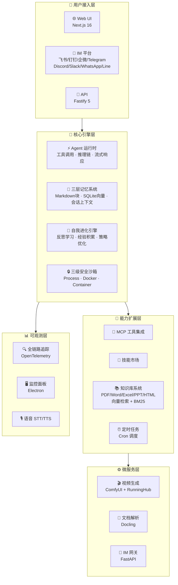

<p align="center">
  
</p>

<p align="center">
  <b>下一代模块化 AI Agent 平台</b> — 持久记忆 · 自我进化 · 多智能体协作 · 知识库 · 视频生成 · 八平台 IM 网关
</p>

<p align="center">
  <a href="https://github.com/Louis830903/Super-Loong/blob/main/LICENSE"></a>
  <a href="https://github.com/Louis830903/Super-Loong"></a>
  <a href="#"></a>
  <a href="#"></a>
  <a href="#"></a>
  <a href="#"></a>
  <a href="#"></a>
  <a href="#"></a>
  <a href="#"></a>
</p>

---

<div align="center">

```
╔══════════════════════════════════════════════════════════════╗
║  🧠 持久记忆 │ 🔄 自我进化 │ 🤝 多智能体协作 │ 📚 知识库    ║
║  🎬 视频生成 │ 💬 IM 网关 │ 🔒 安全沙箱 │ 🧩 MCP 生态  ║
╚══════════════════════════════════════════════════════════════╝
```

</div>

---

## ✨ 为什么选择 Super Agent？

Super Agent 不是又一个 AI 聊天机器人——它是一个**完整的智能体操作系统**。从持久记忆到自我进化，从多 Agent 协作到八平台 IM 接入，从知识库检索到端到端视频生成：**开箱即用，一切皆可 Agent**。



---

## 🚀 核心能力矩阵

<table>
<tr>
<td width="50%">

### 🧠 智能体运行时
完整的 Agent 生命周期管理——工具调用、思维链推理、流式响应、上下文窗口管理。支持多轮对话、工具编排、子代理委派。

**亮点**：支持 8 大国产模型 Provider，从 Qwen 到 DeepSeek，从豆包到 Kimi，一键切换。

</td>
<td width="50%">

### 🤝 多 Agent 协作
编排器（Orchestrator）模式，支持**层级**、**并行**、**串行**三种协作拓扑。Agent 间自动路由、消息传递、结果汇聚。

**亮点**：子代理独立上下文窗口，互不干扰，并行加速。

</td>
</tr>
<tr>
<td width="50%">

### 💾 三层持久记忆
- **L1 — Markdown 块**：结构化知识持久化
- **L2 — SQLite 向量**：语义检索 + 混合搜索
- **L3 — 会话上下文**：短期记忆滑动窗口

**亮点**：跨会话知识保留，越用越懂你。

</td>
<td width="50%">

### 🔒 三级安全沙箱
- **Process 级**：子进程隔离，资源限制
- **Docker 级**：容器化执行，网络隔离
- **Container 级**：完整沙箱，文件系统隔离

**亮点**：代码执行全隔离，安全无忧。

</td>
</tr>
<tr>
<td width="50%">

### 🧬 自我进化引擎
反思学习 + 经验积累 + 策略自适应优化。Agent 从每次任务中学习，持续提升表现。

**亮点**：越用越强，像生物一样进化。

</td>
<td width="50%">

### 🧩 MCP 生态 & 技能市场
原生支持 **Model Context Protocol**（MCP）客户端，无缝对接外部工具生态。插件化技能安装、管理、版本控制。

**亮点**：无限扩展能力边界。

</td>
</tr>
<tr>
<td width="50%">

### 📚 知识库系统
支持 **PDF / Word / Excel / PPT / HTML** 全格式文档解析，**向量检索 + BM25 混合搜索**，基于 Docling 的高质量文档理解。

**亮点**：中文文档理解能力业界领先。

</td>
<td width="50%">

### 🎬 视频生成
**ComfyUI 工作流** + **RunningHub 云端模型**，端到端出片。从文案到成片，全链路自动化。

**亮点**：一句话生成专业级视频。

</td>
</tr>
<tr>
<td width="50%">

### 💬 八平台 IM 网关
| 国内平台 | 国际平台 |
|----------|----------|
| 🐦 飞书 | ✈️ Telegram |
| 📌 钉钉 | 🎮 Discord |
| 💼 企业微信 | 💬 Slack |
| | 📱 WhatsApp |
| | 📲 Line |

**亮点**：一套代码，八平台复用，消息格式自动适配。

</td>
<td width="50%">

### 📊 全链路可观测
**OpenTelemetry** 标准追踪，**Electron 桌面监控面板**，语音 **STT/TTS** 支持。请求级可观测，问题一目了然。

**亮点**：生产级可观测性，排错不抓瞎。

</td>
</tr>
</table>

---

## ⚡ 一键启动

### 📋 环境要求

| 依赖 | 版本 | 说明 |
|------|------|------|
|  | ≥ 20.0.0 | 运行时 |
|  | ≥ 9.0.0 | 包管理 |
|  | ≥ 3.11 | 知识库 / IM / 视频 |
|  | 最新 | Python 依赖管理 |

### 🪄 三步起飞

```bash
# ① 克隆并进入
git clone https://github.com/Louis830903/Super-Loong.git && cd Super-Loong

# ② 一键初始化（依赖安装 + 配置生成 + Python 服务自举）
pnpm setup

# ③ 编辑 .env 填入 API Key，然后启动
pnpm dev
```

<div align="center">

| 服务 | 地址 | 说明 |
|------|------|------|
| 🌐 **Web UI** | http://localhost:3000 | 对话 / Agent 管理 / 知识库 |
| 🔌 **API** | http://localhost:3001 | RESTful API 服务 |
| 🌉 **IM 网关** | http://localhost:8642 | 八平台消息接入 |
| 🖥️ **监控面板** | Electron 窗口 | 桌面级实时监控 |

</div>

> 💡 **零配置哲学**：`pnpm setup` 自动完成一切——加密密钥生成、Node.js 依赖安装、IM Gateway 的 Python venv 创建。`pnpm dev` 启动后，video-forge（视频生成）、im-gateway（IM 网关）自动拉起，kb-parser（知识库解析）首次使用时懒启动。**三个 Python 微服务，零手动配置**。

---

## 🏗️ 架构一览

```
super-agent/                        # 📦 Monorepo 根
│
├── 📁 packages/                    # TypeScript 包
│   ├── 🧠 core/                    #   核心引擎：Agent 运行时 · 记忆 · 进化 · 安全
│   ├── 🔌 api/                     #   Fastify 5 API 服务
│   ├── 🌐 web/                     #   Next.js 16 前端（14 页面）
│   ├── 🖥️ monitor/                 #   Electron 桌面监控面板
│   ├── 🔬 research/                #   评估基准与学术研究
│   └── 📐 web-types/               #   前后端共享类型与常量
│
├── 📁 services/                    # Python 微服务
│   ├── 🌉 im-gateway/              #   八平台 IM 适配网关（FastAPI）
│   ├── 🎬 video-forge/             #   视频生成引擎（ComfyUI）
│   └── 📄 kb-parser/               #   文档解析服务（Docling）
│
├── 📁 data/                        # 运行时数据（不入库）
├── 📁 docs/                        # 项目文档
├── ⚙️ .env.example                 # 环境变量模板
└── 📜 package.json                 # Monorepo 入口
```

---

## 🎯 模型 Provider 矩阵

<table>
<tr>
<td align="center" width="25%">
  <b>☁️ 阿里 DashScope</b><br/>
  <sub>Qwen 全系列 · 多模态</sub>
</td>
<td align="center" width="25%">
  <b>🔍 DeepSeek</b><br/>
  <sub>V3 / R1 · 深度推理</sub>
</td>
<td align="center" width="25%">
  <b>🧠 智谱 GLM</b><br/>
  <sub>GLM-4.7 · 国产旗舰</sub>
</td>
<td align="center" width="25%">
  <b>🌙 Moonshot</b><br/>
  <sub>Kimi K2.5 · 超长上下文</sub>
</td>
</tr>
<tr>
<td align="center" width="25%">
  <b>🌋 火山方舟</b><br/>
  <sub>豆包 Seed 2.0 · 图片生成</sub>
</td>
<td align="center" width="25%">
  <b>✨ MiniMax</b><br/>
  <sub>多模态理解与生成</sub>
</td>
<td align="center" width="25%">
  <b>🤖 OpenAI</b><br/>
  <sub>GPT 系列 · 可选</sub>
</td>
<td align="center" width="25%">
  <b>🏠 Ollama</b><br/>
  <sub>本地模型 · 离线运行</sub>
</td>
</tr>
</table>

---

## ⚙️ 开发指南

```bash
pnpm install      # 安装依赖
pnpm dev          # 开发模式（全服务热重载）
pnpm build        # 生产构建
pnpm test         # 运行测试
pnpm lint         # 代码检查
pnpm clean        # 清理构建产物
```

<details>
<summary>🔧 按模块启动（高级）</summary>

```bash
pnpm dev:api       # 仅启动 API 服务
pnpm dev:web       # 仅启动 Web UI
pnpm dev:monitor   # 仅启动监控面板
pnpm dev:gateway   # 仅启动 IM 网关
```

</details>

---

## 🤝 贡献

欢迎提交 Issue、PR 或 Star ⭐！详见 [CONTRIBUTING.md](CONTRIBUTING.md)（如有）。

---

<div align="center">

**[📖 文档](docs/)** · **[🐛 报告问题](https://github.com/Louis830903/Super-Loong/issues)** · **[💡 功能建议](https://github.com/Louis830903/Super-Loong/issues)**

<sub>Made with ❤️ by the Super Agent Team · MIT License</sub>

</div>
